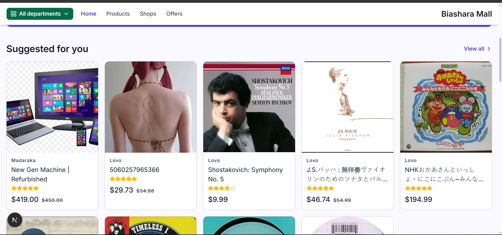
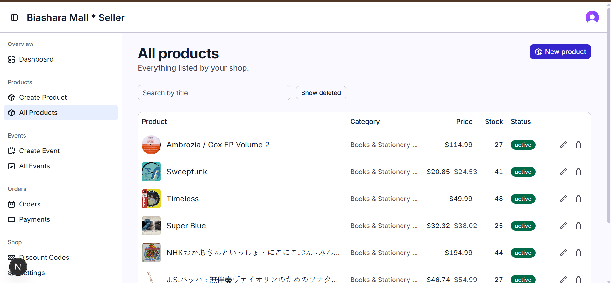
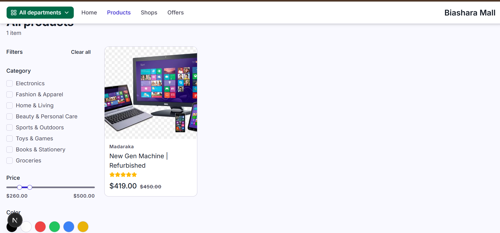

# Biashara Mall

Multi-vendor e-commerce SaaS. Storefront, seller dashboard, and admin panel as separate Next.js apps, backed by an Express microservice API behind a gateway.

**Stack:** Nx monorepo, bun, Next.js (App Router) + shadcn/ui, Express, Prisma + MongoDB (replica set), Redis, Clerk auth, Stripe.

## Screenshots

**Storefront**


**Seller dashboard**


**Product listing**


## Prerequisites

- bun or npm
- Docker (for MongoDB, Redis, and Redpanda/Kafka)
- A [Clerk](https://clerk.com) application (dashboard, API keys)

## Setup

```bash
bun install
docker compose up -d

cp .env.example .env
# fill in Clerk keys, Stripe keys, etc.

bun run prisma:push
```

Each `apps/*-ui` app also needs its own `.env.local`. See the bottom of `.env.example` for the required keys.

## Running

```bash
bun run dev              # everything: gateway, all services, all UIs
bun run dev:services     # just the backend services + gateway
bun run dev:user-ui      # a single UI, e.g. user-ui
```

Services read `.env` at boot only, restart after editing it.

| App                  | Port |
| -------------------- | ---- |
| api-gateway          | 8080 |
| user-ui (storefront) | 3000 |
| seller-ui            | 3001 |
| admin-ui             | 3002 |
| user-service         | 6001 |
| product-service      | 6002 |
| seller-service       | 6003 |
| order-service        | 6004 |
| admin-service        | 6005 |

## Roadmap (very high level)

- [x] Foundation: auth, multi-tenant shops, product catalog
- [x] Storefront: browsing, search, filters
- [x] Cart, wishlist, order tracking
- [x] Payments & checkout (Stripe but for now it's just a mock)
- [x] Order management
- [ ] Admin panel
- [ ] Real-time analytics (Kafka)
- [ ] Live chat
- [ ] ML-based product recommendations
- [ ] Production hardening & deployment
